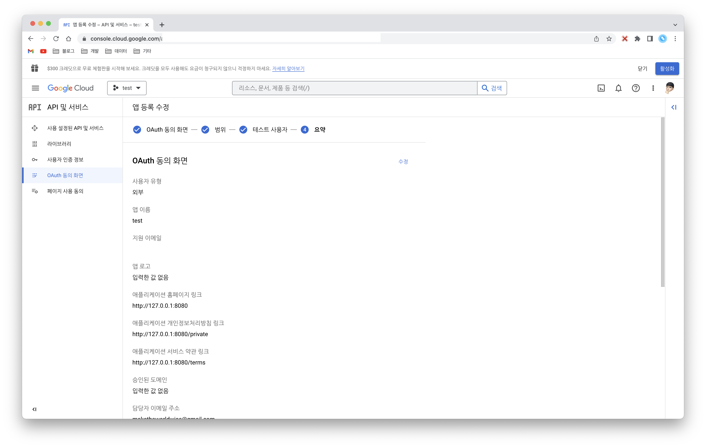

# test-social-nestjs

> 이 프로젝트는 NestJS의 소셜 로그인을 간단하게 확인하기 위한 용도로 만들어졌습니다.

## MySQL

대략적으로 잡은 테이블 구조는 다음과 같습니다. (데이터는 직접 넣어야 합니다.)

```mariadb
create table users
(
    id         int auto_increment,
    name       varchar(255)                        not null,
    email      varchar(255)                        not null,
    password   varchar(255)                        not null,
    phone      varchar(255)                        not null,
    created_at timestamp default CURRENT_TIMESTAMP not null,
    updated_at timestamp default CURRENT_TIMESTAMP not null on update CURRENT_TIMESTAMP,
    primary key (id),
    index idx_email (email)
);

create table user_social_keys
(
    id            int auto_increment,
    user_id       int                                                    not null,
    provider      enum ('naver', 'kakao', 'google', 'facebook', 'apple') not null,
    client_id     varchar(255)                                           not null,
    client_secret varchar(255)                                           not null,
    callback_url  varchar(255)                                           not null,
    created_at    timestamp default CURRENT_TIMESTAMP                    not null,
    updated_at    timestamp default CURRENT_TIMESTAMP                    not null on update CURRENT_TIMESTAMP,
    primary key (id),
    index idx_user_provider_key (user_id, provider)
);
````

## Naver


## Kakao


## Google





## Naver-dynamic

- 발급받은 키를 동적으로 넣어 전략을 구성할 경우, users 및 user_social_keys 테이블에 데이터가 필요함
- 반드시 user_social_keys 테이블의 callback_url 뒤에는 userId가 붙어야하며, 해당 url도 네이버에 등록해주어야 함 
  - http://127.0.0.1/auth/naver/dynamic?userId=1


## Reference

- http://www.passportjs.org/packages/passport-naver/
- https://soraji.github.io/back/2022/12/15/sociallogin/